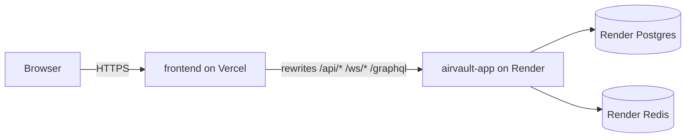

# Requirements

### Overview & Goals

Simplify production infrastructure by producing clean, production-ready deployment configs for Render (backend + Postgres + Redis) and Vercel (frontend), refreshing the deployment guide, and removing obsolete infrastructure files — all without touching app logic.

### Scope

#### In Scope
- **`render.yaml`** — remove the legacy Python `airvault-backend` service; keep and polish the `airvault-app` (PayloadCMS + .js), `airvault-postgres`, and `airvault-redis` resources.
- **`frontend/vercel.json`** — add `rewrites` for `/api/*`, `/ws/*`, `/graphql` proxy; add all required env var references; add CORS-safe security headers.
- **`DEPLOY.md`** — rewrite as a clean, step-by-step guide covering: git push → Render Blueprint → Vercel import → custom domains → env vars → verification.
- **Remove / archive** the legacy `backend/` directory reference from Render config (the directory itself is kept intact but dropped from deploy).
- No Terraform or Helm files were found in the repo — no further removal needed.

#### Out of Scope
- Fixing local Docker Compose issues.
- Any changes to app source code in `payload-app/` or `frontend/`.
- Setting up CI/CD pipelines.
- Monitoring/observability stack changes.

### User Stories
- As a developer, I want a single `render.yaml` that deploys only the PayloadCMS monorepo service (with managed Postgres and Redis) so that I can spin up the backend with one Render Blueprint click.
- As a developer, I want a correct `vercel.json` in the `frontend/` directory so that Vercel auto-configures rewrites, security headers, and env vars without manual setup.
- As a developer, I want a clear `DEPLOY.md` so that I can follow step-by-step instructions to go from repo push to live production in under an hour.

# Technical Design

### Current Implementation

 File | Current State | Problem |
------|---------------|---------|
 `/render.yaml` | Defines postgres + redis + **two** web services (`airvault-app` and `airvault-backend`) | Legacy Python backend service bloats the blueprint; shouldn't be deployed |
 `/frontend/vercel.json` | Framework + build command + one env var + security headers | Missing `rewrites` for `/api/*`, `/ws/*`, `/graphql` (those live in `.config.js` but Vercel's edge network needs them declared in `vercel.json` to proxy correctly) |
 `/DEPLOY.md` | Comprehensive but mixes old Python backend notes, mentions Kafka prominently | Needs streamlining for the Render + Vercel dual-service setup |
 `/backend/` directory | Python FastAPI source; referenced in current `render.yaml` | Should be dropped from the `render.yaml` blueprint (source kept locally) |

### Architecture



### Proposed Changes

#### `render.yaml` (root of repo)
- **Remove** the entire `airvault-backend` service block (Python FastAPI).
- **Keep** `airvault-postgres`, `airvault-redis`, and `airvault-app`.
- Add `region: oregon` (Render default; makes it explicit).
- Verify `dockerfilePath`, `dockerContext`, and `dockerCommand` match the existing `payload-app/Dockerfile`.
- Ensure all env vars align with `payload.config.ts` expectations (`DATABASE_URI`, `REDIS_URL`, `PAYLOAD_SECRET`, etc.).

#### `frontend/vercel.json`
- Add a `rewrites` array to proxy `/api/:path*`, `/ws/:path*`, and `/graphql` to `$_PUBLIC_API_URL` (Render service URL).
- Add `_PUBLIC_API_URL` and `_PUBLIC_SERVER_URL` as Vercel environment variable references.
- Retain the existing security headers (`X-Frame-Options`, `X-Content-Type-Options`).
- Set `"framework": "js"`, `"buildCommand": "npm run build"`, `"outputDirectory": "."`.

> **Note:** `frontend/.config.js` already defines `rewrites()` for local dev. In production on Vercel, `vercel.json` rewrites take precedence and handle the proxying — both can coexist.

#### `DEPLOY.md` (root of repo)
- **Step 1** — Push repo to GitHub.
- **Step 2** — Render Blueprint (detect `render.yaml`, provision Postgres + Redis + `airvault-app`, fill in manual secrets).
- **Step 3** — Vercel import (connect `frontend/` subdirectory, set `_PUBLIC_API_URL` to Render URL).
- **Step 4** — Custom domains (optional CNAME setup).
- **Step 5** — Verification curl commands.
- Include env vars reference table.

### File Structure — Files Changed

```
airvault-concierge/
├── render.yaml            ← MODIFIED (remove airvault-backend service)
├── DEPLOY.md              ← MODIFIED (full rewrite for Render + Vercel)
└── frontend/
    └── vercel.json        ← MODIFIED (add rewrites + env vars)
```

No files are created or deleted. No app source files are touched.

# Env Vars Reference

### Render (`airvault-app`) Environment Variables

 Variable | Source | Notes |
---|---|---|
 `PAYLOAD_SECRET` | Render auto-generated | PayloadCMS JWT secret |
 `DATABASE_URI` | Render auto-linked from `airvault-postgres` | Primary connection string |
 `DATABASE_URL` | Render auto-linked from `airvault-postgres` | Legacy alias |
 `REDIS_URL` | Render auto-linked from `airvault-redis` | ioredis connection |
 `STRIPE_SECRET_KEY` | Manual (Render dashboard) | `sk_live_...` or `sk_test_...` |
 `RAPIDAPI_KEY` | Manual (Render dashboard) | Flight data API |
 `KAFKA_BOOTSTRAP_SERVERS` | Optional (leave blank to disable) | Upstash Kafka URL |
 `_PUBLIC_SERVER_URL` | Set to Render URL | e.g. `https://airvault-app.onrender.com` |
 `_PUBLIC_API_URL` | Same as above | Used by PayloadCMS config |

### Vercel (`frontend`) Environment Variables

 Variable | Value | Notes |
---|---|---|
 `_PUBLIC_API_URL` | `https://airvault-app.onrender.com` | Must match Render service URL |

> Add via Vercel dashboard → Project → Settings → Environment Variables, or via `vercel env add`.

# Delivery Steps

### ✓ Step 1: Update render.yaml — remove legacy Python backend service
The root `render.yaml` declares only the three correct resources: `airvault-postgres`, `airvault-redis`, and `airvault-app` (PayloadCMS + .js).

- Remove the entire `airvault-backend` service block (Python FastAPI — Docker build from `./backend/Dockerfile`).
- Add `region: oregon` to `airvault-app` for explicitness.
- Verify `dockerfilePath: ./payload-app/Dockerfile`, `dockerContext: ./payload-app`, and `dockerCommand` match the existing Dockerfile's CMD.
- Confirm all env var bindings are correct: `DATABASE_URI` and `DATABASE_URL` both auto-linked from `airvault-postgres`; `REDIS_URL` from `airvault-redis`; `PAYLOAD_SECRET` auto-generated; manual vars (`STRIPE_SECRET_KEY`, `RAPIDAPI_KEY`, `KAFKA_BOOTSTRAP_SERVERS`) retained with `sync: false`.

### ✓ Step 2: Update frontend/vercel.json — add rewrites and complete env var config
The `frontend/vercel.json` is updated so Vercel's edge network properly proxies API, WebSocket, and GraphQL traffic to the Render backend.

- Add a `rewrites` array with three rules:
  - `/api/:path*` → `$_PUBLIC_API_URL/api/:path*`
  - `/ws/:path*` → `$_PUBLIC_API_URL/ws/:path*`
  - `/graphql` → `$_PUBLIC_API_URL/graphql`
- Ensure `_PUBLIC_API_URL` is declared as a Vercel environment variable reference (`@_public_api_url`).
- Retain existing `framework`, `buildCommand`, `outputDirectory`, and security headers.
- Confirm `rootDirectory` is set to `frontend` (so Vercel builds from the correct subdirectory when the full monorepo is connected).

### ✓ Step 3: Rewrite DEPLOY.md — clean step-by-step Render + Vercel deployment guide
The root `DEPLOY.md` is fully rewritten to reflect the final two-platform architecture (Render for backend + Vercel for frontend), removing references to Terraform, Helm, AWS, and the legacy Python backend.

- **Step 1 — Push to GitHub:** `git add . && git commit && git push`.
- **Step 2 — Render Blueprint:** New → Blueprint → connect repo → Render auto-provisions Postgres, Redis, and `airvault-app` → fill in `STRIPE_SECRET_KEY`, `RAPIDAPI_KEY` in the Render dashboard → note the service URL.
- **Step 3 — Vercel import:** Import the repo on Vercel → set Root Directory to `frontend` → add `_PUBLIC_API_URL` env var → deploy.
- **Step 4 — Custom domains (optional):** CNAME setup table for both Render and Vercel.
- **Step 5 — Verification:** curl commands for `/api/health`, `/admin`, `/api/graphql`, `/api/v1/flights/search`, `/api/v1/meals`, `/api/v1/rides/request`.
- Include the env vars reference table for both platforms.